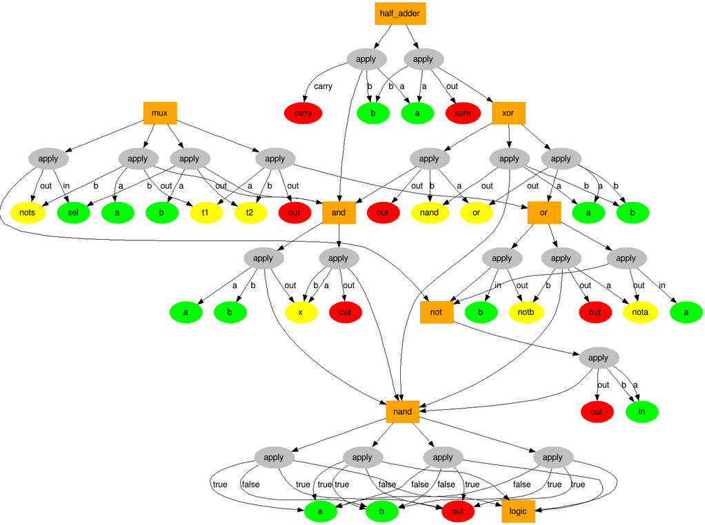

## hardware-description-language

[](https://travis-ci.org/tuzz/hdl.js)

(Work in progress)

This is an attempt at writing a hardware description language that is at least
as powerful as that of the language used in the book ["Elements of Computing
Systems"](http://www.amazon.co.uk/dp/0262640686).

## Setup Instructions

You'll need to have installed [nodejs](https://nodejs.org/en/) first.

Install grunt command line:

```
npm install grunt-cli -g
```

Install the dependent node modules:

```
npm install
```

To run the test suite:

```
grunt
```

You can run a single test by globally installing jasmine-node:

```
npm install jasmine-node -g
```

And then:

```
jasmine-node spec/hdlSpec.js
```

If the suite successfully builds, you can embed the bin/hdl.js file in your
web application. See examples/ for more information.

Let me know if you have trouble with any of this.

## Background

The grammar for the language is more-or-less the same, with a few differences:

- Support for defining truth tables
- Clocking of chips is simpler, you just make use of the 'clocked' chip
- Chip names are not included and will instead be inferred from filenames
- No semicolons
- Comment with # instead of //
- Everything is lowercase

The order in which chips are defined should not matter. You can define chips
that depend on chips that haven't been defined yet. Once all of its dependencies
are defined, you will be able to evaluate expressions on the chip.

## How it works

The parser runs in two passes. It first reads through the input and builds an
intermediate representation, which is just structured data that is easier to
work with.

The second pass makes sense of this structured data and produces a graph. This
graph is then added as a subgraph of a wider 'environment', which connects the
subgraphs together.

Here's an example:



## Next steps

I now need to write the logic to traverse the environment's graph to 'evaluate'
expressions on chips.

I then need to extend that logic to support buses. This data is captured in the
environment graph.

I then need to extend that logic to support the 'clocked' chip. This will be a
special kind of chip that persists state on its 'apply' nodes.

I'd also like to see if I can push as much error checking to 'compile' time
rather than 'runtime'. I should check for cycles, bus size mismatches, etc.

## Future plans

I'd like to see if I can turn the problem on its head a little. I'm wondering
whether it's possible to specify a chip and specify an output to that chip. A
process would then attempt to find a valid input that produces the specified
output.

I plan to do this by [reducing](http://en.wikipedia.org/wiki/Reduction_%28complexity%29)
a schematic for a chip to the [boolean satisfiability problem](http://en.wikipedia.org/wiki/Boolean_satisfiability_problem).
I then plan on feeding the resultant boolean equation to a SAT solver.

My first use case is to solve the problem of finding [self enumerating pangrams](http://en.wikipedia.org/wiki/Pangram#Self-enumerating_pangrams).
I think I've figured out how to build a chip that can take a set of frequences
as input, as well as the 'sentence seed'. It would have a single output -
whether it's a self-enumerating pangram, or not.

More generally, I'd like to explore whether there's a high-level language
abstraction I can create that allows developers to express their problem and
the language finds solutions for it. Similar to declarative languages, such as
Prolog.

## Help would be appreciated

I'd love some help or second opinions on any of this. I've been mulling this
over for some time and now I'm trying to get it out of my head and into code.
